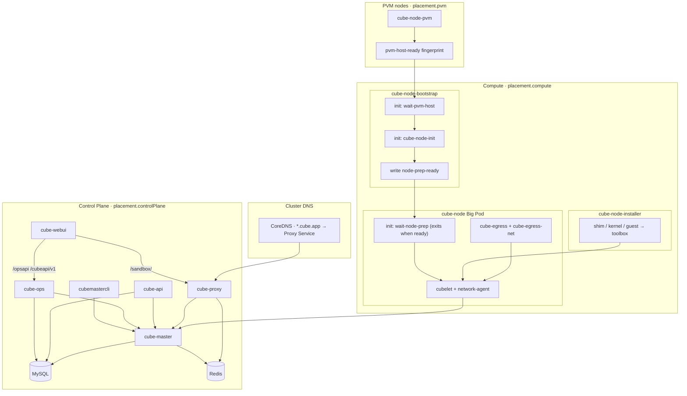
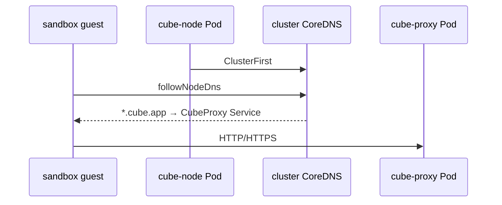
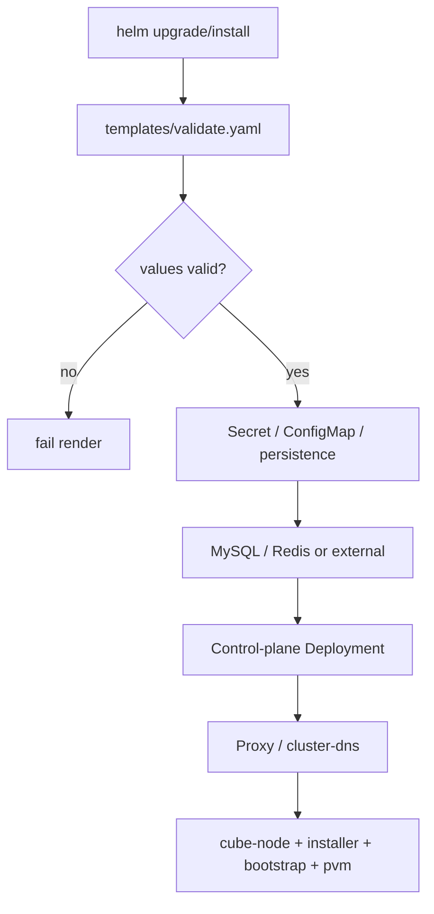
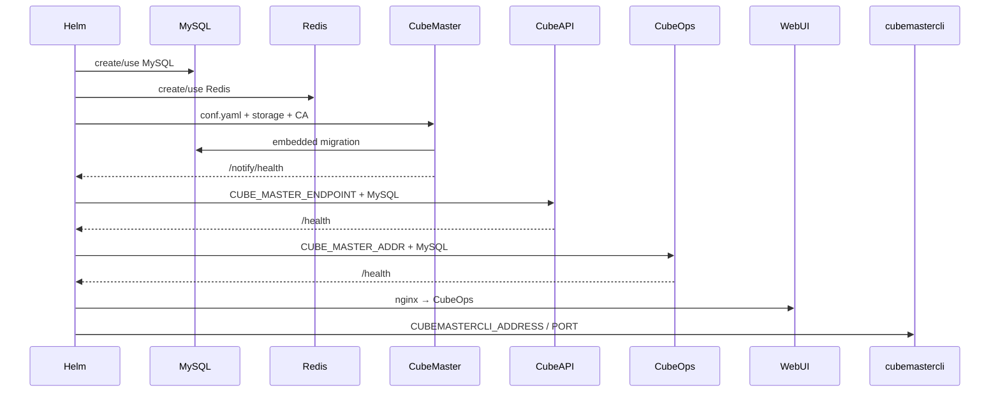
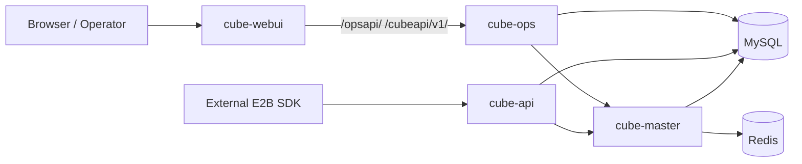
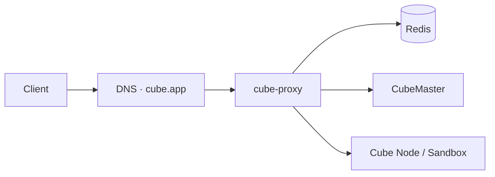
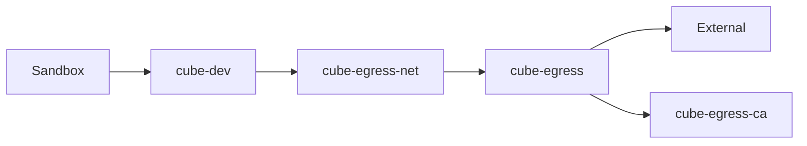
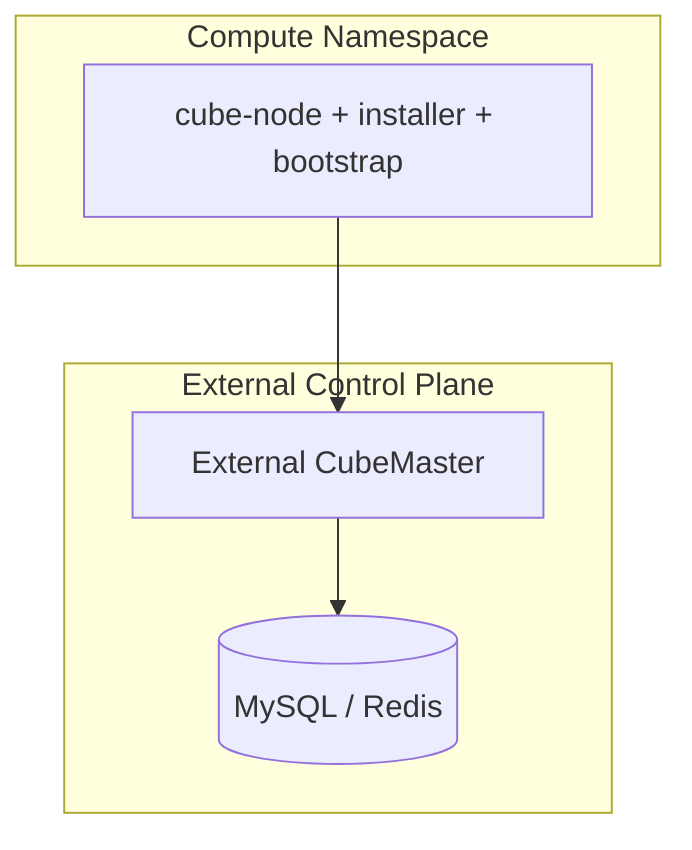

# Architecture

This page describes how CubeSandbox is delivered via the **Kubernetes / Helm Chart**: component layers, the four compute DaemonSets, install and startup order, and runtime paths for DNS / Proxy / Egress.

For install steps, see [Helm Install](./install.md). For compute image upgrades, see [Upgrade](./upgrade.md). For troubleshooting, see [FAQ](./faq.md).

::: tip Difference from “product architecture”
[Architecture Overview](../../architecture/overview.md) covers CubeSandbox **product components** (CubeMaster / Cubelet / MicroVM, etc.). This page covers how those components are **placed, scheduled, and started on K8s**.
:::

## 1. Overall layers

| Layer | Component | Kubernetes form | Main responsibility |
| --- | --- | --- | --- |
| Control plane | CubeMaster | Deployment + Service + Secret + PVC/hostPath | Node registration, template/rootfs artifacts, embedded DB migration, scheduling/metadata |
| Control-plane API | CubeAPI | Deployment + Service | External E2B-compatible HTTP API; reads/writes MySQL; talks to CubeMaster |
| Ops backend | CubeOps | Deployment + Service | JWT ops API + WebUI SDK; listens on `0.0.0.0:3010`; reads/writes MySQL; talks to CubeMaster |
| Admin entry | WebUI | Deployment + Service + ConfigMap | Static console; reverse-proxies `/opsapi/` and `/cubeapi/v1/` to CubeOps (depends on `cubeOps.enabled`) |
| Ops entry | cubemastercli | Deployment | CLI for `kubectl exec`; injects this Release’s CubeMaster endpoint |
| Dependent storage | MySQL / Redis | Built-in StatefulSet or third-party | Business data / Proxy and lifecycle state |
| Compute · runtime | `cube-node` (Big Pod) | Native `apps/v1` DaemonSet | `wait-node-prep` init + cubelet / network-agent + optional egress |
| Compute · artifacts | `cube-node-installer` | Native `apps/v1` DaemonSet | Installs shim / kernel / guest into the host toolbox |
| Compute · node bootstrap | `cube-node-bootstrap` | Native `apps/v1` DaemonSet | `wait-pvm-host`, `cube-node-init`, writes `node-prep-ready` |
| Compute · PVM host | `cube-node-pvm` | Native `apps/v1` DaemonSet (`placement.pvm` only) | PVM host kernel install (may reboot); manages L0 taints and writes fingerprints |
| Data-plane entry | CubeProxy + cluster DNS | Deployment; optionally rewrites CoreDNS | HTTP/HTTPS sandbox entry; `*.domain` wildcard resolution |
| Lifecycle | cube-lifecycle-manager | Deployment + ClusterIP | sandbox pause/resume; discovers Proxy replicas via Redis |

Default full deployment:



## 2. Resource and image responsibilities

### 2.1 Control plane

| Resource | Chart template | Notes |
| --- | --- | --- |
| `cube-master` | `templates/master.yaml` | `images.master`; mounts Chart-rendered `conf.yaml`; embedded schema migration |
| `cube-master-config` | `templates/master-config-secret.yaml` | Rendered result of `files/cube-master/conf.yaml` |
| `cube-master-storage` | `master.yaml` / `master-pvc.yaml` | Default PVC; optional existingClaim / hostPath / emptyDir |
| `cube-api` | `templates/api.yaml` | `images.api` (external E2B) |
| `cube-ops` | `templates/ops.yaml` | `images.ops`; ClusterIP; bind `0.0.0.0:3010` |
| `cubemastercli` | `templates/cubemastercli.yaml` | `images.cubemastercli` |
| `cube-webui` | `templates/webui.yaml` | `images.webui` + nginx ConfigMap (upstream CubeOps) |
| `cube-secret` | `templates/secret.yaml` | MySQL / Redis / Proxy passwords, etc. |

### 2.2 MySQL / Redis

| Mode | Behavior |
| --- | --- |
| Built-in MySQL | `mysql.host=""` → StatefulSet + Headless Service; optional `mysql.persistence.hostPath` |
| Third-party MySQL | Non-empty `mysql.host` → do not install built-in MySQL |
| Built-in Redis | `redis.host=""` and control plane or Proxy needs it → install |
| Third-party Redis | Non-empty `redis.host` → do not install built-in Redis |

### 2.3 Compute plane: four DaemonSets

`cube-node` / `cube-node-installer` / `cube-node-bootstrap` use `placement.compute` (**without** `allow-pvm-bootstrap`). `cube-node-pvm` uses `placement.pvm` (includes `allow-pvm-bootstrap`), so non-PVM nodes do not pull the large `cube-pvm-host-bootstrap` image.

All four compute lines (Big Pod / installer / bootstrap / PVM) are native `apps/v1` DaemonSets. Stateless control plane (master/api/ops/webui/proxy/lifecycle/cubemastercli) uses native Deployments; MySQL/Redis continue to use native StatefulSets.

#### Big Pod: `cube-node`

- `hostNetwork: false` (Pod network); native `apps/v1` DaemonSet.
- **initContainer**: `wait-node-prep` (**exits 0** when the fingerprint matches; not a long-running sidecar).
- Image / resource / Pod template changes **recreate** the Big Pod (PodIP/netns change; existing sandboxes interrupt). See [Upgrade](./upgrade.md).
- **NodeID** = `spec.nodeName`; **Endpoint** = `status.podIP`.
- toolbox **whole tree** hostPath: `/usr/local/services/cubetoolbox`.

| Container | Image | Responsibility |
| --- | --- | --- |
| `wait-node-prep` (init) | `images.waitNodePrep` | Read-only hostPath `node-prep-ready` self-describing fingerprint; exits when matched so run containers can start |
| `network-agent` | `images.networkAgent` | Starts after self-stage |
| `cubelet` | `images.cubelet` | Starts after self-stage |
| `cube-egress` / `cube-egress-net` | matching images | Optional; transparent egress / TPROXY |

**Container names / volumeMount / securityContext / imagePullPolicy changes also recreate**.

#### Installer: `cube-node-installer`

- Containers: `cube-shim-install` / `cube-kernel-install` / `cube-guest-install`.
- Replaces whole directories of shim / kernel / guest from the image into the host toolbox; during directory swap the version matrix is briefly marked incomplete, then restored on success.
- Can RollingUpdate independently; for day-to-day artifact upgrades **only bump Installer images**.

#### Bootstrap: `cube-node-bootstrap`

- init: `wait-pvm-host` → `cube-node-init`; main container writes `node-prep-ready`.
- `wait-pvm-host`: checks whether the node has `allow-pvm-bootstrap`—if yes, waits for PVM host ready and records “this node uses PVM guest”; if not, records “this node uses bm guest”.
- Sentinel directory: `/var/lib/cube-node-bootstrap` (shared with Big Pod `wait-node-prep` / PVM DS).
- `hostPID: true` (`nsenter --target 1`); low-frequency changes; for node-init upgrades **only bump Bootstrap / nodeInit images**.

#### PVM: `cube-node-pvm`

- Native `apps/v1` DaemonSet; created only when `bootstrap.pvmHostKernel.enabled=true`; scheduled only to `placement.pvm`.
- `startupGate` is on by default: when the target node fingerprint is not ready, a Helm pre-install/pre-upgrade Hook writes `cube.tencent.com/pvm-not-ready=true:NoSchedule`, then probes CNI node by node; if the fingerprint already matches, that taint is not written.
- Before install/upgrade there is also a cubevs CIDR Hook (weight `-110`): if `cubeNode.network.cidr` (default `172.16.0.0/18`) overlaps the cluster Service CIDR / ClusterIP, fail-fast.
- init: `pvm-host-bootstrap`; mutate strictly follows ensure taint → delete dependent Pods in this namespace/this release/this node → invalidate → Lease → mutate/reboot.
- Success path: write ready → verify live fingerprint → clear taint; main container reconciles split state every 30 seconds.
- Only the PVM DaemonSet tolerates the temporary gate. CNI and kube-proxy must tolerate the gate with `Exists` or an explicit key. PVM stays on Pod network.
- For PVM image upgrades **only bump `images.pvmHostBootstrap`**; do not recreate the Big Pod.

Why four pieces: separate artifact install from rebootable PVM bootstrap; non-PVM compute nodes do not pull the large PVM image; Installer / Bootstrap / PVM bumps can leave the Big Pod template untouched.

### 2.3.1 Markers you will see on the node

| Marker | Meaning |
| --- | --- |
| `pvm-host-ready` | Host PVM kernel is installed as expected; content includes a fingerprint that must match current `uname` after kernel swap to count as ready |
| `effective-pvm` | Whether this node’s guest should use PVM (`1`) or bm (`0`); with `allow-pvm-bootstrap` and host ready → `1`, otherwise → `0` |
| `node-prep-ready` | Bootstrap preflight passed; Big Pod may start |
| `/run/wait-node-prep.ready` | Per-Pod temporary marker for this round; gone on restart |
| “component ready” markers under toolbox | That component staged successfully; artifacts can be collected into the version matrix |
| “component replacing” markers under toolbox | Directory swap in progress; matrix marked incomplete; cleared on success, left until next success on failure |

Guest kernel selection: first check `effective-pvm`; if missing, try to keep the kernel already in use on the node; only then fall back to the Chart’s first-install default (`cubeNode.pvmGuestKernel.enabled`).

### 2.4 Data-plane entry

| Resource | Chart template | Responsibility |
| --- | --- | --- |
| `cube-proxy` | `templates/proxy.yaml` | sandbox HTTP/HTTPS; `placement.controlPlane`; Pod network |
| `cube-lifecycle-manager` | `templates/lifecycle-manager.yaml` | pause/resume; Proxy discovers replicas via Redis |
| `cube-proxy-certs` | `proxy.yaml` | TLS: selfSigned / inline / existingSecret / certManager |
| Service / Ingress | `proxy-service.yaml` / `proxy-ingress.yaml` | ClusterIP; Ingress SSL passthrough, TLS terminated at Proxy |
| cluster DNS | `templates/cluster-dns.yaml` | When enabled, rewrite `*.cubeProxy.domain` to the Proxy Service |

CubeProxy forwards to the target compute-node sandbox via owner metadata in Redis.

## 3. DNS

The Chart **does not** deploy its own CoreDNS. When Proxy is enabled and `configureClusterDNS=true` (default):

- A Helm hook rewrites `domain` / `*.domain` to `<release>-proxy.<ns>.svc.cluster.local`.
- `cubeNode.dns.sandbox.followNodeDns=true`: guest follows node/cluster DNS.



- Domain: `cubeProxy.domain` (default `cube.app`).
- If the platform forbids changing `kube-system/coredns`, set `cubeProxy.configureClusterDNS=false`.
- External clients still need their own public/Private DNS or LB.

## 4. Install and startup

### 4.1 Helm render



Main validations:

- When enabling control plane / compute / Proxy, the matching `placement.*.nodeSelector` must be set.
- `configureClusterDNS=true` requires `cubeProxy.domain`.
- compute-only requires `externalControlPlane.masterEndpoint`.
- When `pvmHostKernel.enabled=true`, `placement.pvm` must include `allow-pvm-bootstrap`, and it **must not** be written under `placement.compute`.
- `security.hostNetwork` has been removed; cube-node is fixed to Pod network.

Scheduling: control plane uses `placement.controlPlane`; `cube-node` / installer / bootstrap use `placement.compute`; `cube-node-pvm` uses `placement.pvm`. Chart-managed containers get `TZ` injected via `global.timezone` (default `Asia/Shanghai`).

### 4.2 Control-plane startup



No separate `cube-db-migrate` Job; `cubemastercli` is not mixed into master/node images.

### 4.3 Compute-node startup

```mermaid
sequenceDiagram
  participant PVM as cube-node-pvm
  participant Boot as cube-node-bootstrap
  participant Inst as cube-node-installer
  participant Wait as wait-node-prep
  participant CN as cube-node
  participant CM as CubeMaster

  alt allow-pvm-bootstrap node
    PVM->>PVM: pvm-host-bootstrap may reboot
    Note over PVM: delete various ready markers before mutate
    PVM->>PVM: write pvm-host-ready fingerprint
  end
  Boot->>Boot: wait-pvm-host label + fingerprint gate
  opt nodeInit.enabled
    Boot->>Boot: cube-node-init
  end
  Boot->>Boot: write node-prep-ready
  Inst->>Inst: stage shim/kernel/guest
  Wait->>Wait: poll fingerprint → exit 0
  Wait-->>CN: init done; run containers start
  CN->>CN: self-stage; pick guest kernel by node PVM
  CN->>CM: register + heartbeat
```

Probe conventions:

- cubelet: startup waits on 9999; readiness defaults to exec (9999 + network-agent `/readyz` + sock); liveness checks 9999.
- `cube-egress`: `127.0.0.1:9090/admin/v1/health`.
- `cube-egress-net`: `cube-dev`, ip rule, table 100, mangle `TRANSPROXY`.

### 4.4 Registration and acceptance checkpoints

- CubeMaster `/notify/health`, CubeOps `/health`, CubeAPI `/health` (if enabled).
- CubeAPI (or via CubeOps SDK) can see healthy nodes.
- `cube-node` / installer / bootstrap ready counts equal the number of nodes matching `placement.compute`; `cube-node-pvm` ready count equals nodes matching `placement.pvm`.
- When egress is enabled, sidecars are Ready.

## 5. Runtime data flows

### 5.1 WebUI / CubeOps / CubeAPI / Master



### 5.2 Sandbox entry



Without an Ingress Controller you can disable `cubeProxy.ingress.enabled` and wire external traffic to the Service yourself. Production should provide real certificates and point the sandbox domain at Ingress.

### 5.3 Outbound egress



Master / API / Node share `cube-egress-ca` so template builds and runtime trust stay consistent.

### 5.4 Template build

When `controlPlane.templateBuilder.enabled=true`, the Master Pod adds a `template-builder` sidecar (default `docker:27-dind`); artifacts are written to Master storage.

## 6. compute-only / external control plane



```yaml
controlPlane:
  enabled: false
externalControlPlane:
  enabled: true
  masterEndpoint: <external-master>:8089
  apiEndpoint: http://<external-api>:3000  # optional, for helm test
```

Does not install built-in Master / API / MySQL / Redis / WebUI; by default does not install Proxy (to avoid inconsistency with an external data plane). When `apiEndpoint` is set, helm test validates the external API and node registration.

## 7. Key values toggles

| values path | Default | Effect |
| --- | --- | --- |
| `global.timezone` | `Asia/Shanghai` | Injects `TZ` into Chart-managed containers |
| `storageClass.create` / `name` / `provisioner` | `create=false` | Whether the chart creates a StorageClass; default is no (PVCs use cluster default SC; TKE uses `values-tke.yaml`) |
| `persistence.storageClassName` | `""` | Shared SC for the three PVCs; `""` → cluster default |
| `*.persistence.storageClassName` (master/mysql/redis) | `""` | Per-component override; non-empty wins over top-level |
| `controlPlane.enabled` | `true` | Built-in control plane |
| `externalControlPlane.enabled` | `false` | External CubeMaster |
| `placement.controlPlane.nodeSelector` | `cube-control=true` | Control-plane scheduling |
| `placement.compute.nodeSelector` | `cube-node=true` | Compute (without allow-pvm) |
| `placement.pvm.nodeSelector` | also includes `allow-pvm-bootstrap=true` | PVM host DaemonSet only |
| `cubeProxy.domain` | `cube.app` | sandbox domain |
| `cubeProxy.configureClusterDNS` | `true` | Whether to write cluster CoreDNS |
| `cubeNode.dns.sandbox.followNodeDns` | `true` | guest follows node DNS |
| `cubeNode.pvmGuestKernel.enabled` | `true` | Whether first-install default prefers PVM guest |
| `bootstrap.pvmHostKernel.enabled` | `true` | host kernel bootstrap (may reboot nodes) |
| `bootstrap.pvmHostKernel.startupGate.enabled` | `true` | Hard NoSchedule node taint gate when PVM is not ready |
| `bootstrap.pvmHostKernel.bootArgs` | `nopti pti=off` | Current `kvm_pvm` does not support host KPTI |
| `bootstrap.nodeInit.*` | several | Preflight, XFS, KVM, CIDR |
| `mysql.host` / `redis.host` | `""` | Non-empty → use third-party |
| `cubeProxy.enabled` / `ingress.enabled` | `true` | Proxy / Ingress |
| `lifecycleManager.enabled` | `true` | Required when Proxy is enabled |
| `cubeEgress.enabled` | `true` | Big Pod egress sidecar |
| `cubeOps.enabled` | `true` | CubeOps (JWT ops API; WebUI upstream) |
| `webui.enabled` | `true` | WebUI (requires `cubeOps.enabled=true`) |
| `controlPlane.templateBuilder.enabled` | `false` | Template-builder sidecar |

## 8. Helm test

| Test Pod | Coverage |
| --- | --- |
| `<release>-health-test` | Master / Ops / API / node registration / WebUI / Proxy / workload Ready / Egress presence |
| `<release>-mysql-test` / `redis-test` | Built-in dependency connectivity |
| `<release>-dns-test` | `cube.app` / wildcard → Proxy Service |
| `<release>-node-image-test` | Runtime tools and assets inside the image |
| `<release>-node-runtime-test` | `/dev/kvm`, cubelet / network-agent sockets |

```bash
helm test <release> -n <namespace> --timeout 20m --logs
```

## 9. Ownership and uninstall boundaries

The Chart manages and removes with the release: control- and compute-plane workloads, built-in MySQL/Redis, Proxy, CA/TLS/config Secrets, Helm test RBAC, diagnostics ConfigMap, etc.

The Chart **does not** manage: node labels/taints, third-party DBs, external DNS/LB, hostPath data, host kernel / GRUB / udev / fstab / XFS and other node-level persistent changes. After uninstall, clean host leftovers per platform runbook.

---

## Next steps

- [Helm Install](./install.md)
- [Upgrade](./upgrade.md)
- [FAQ](./faq.md)
- [Product Architecture Overview](../../architecture/overview.md)
